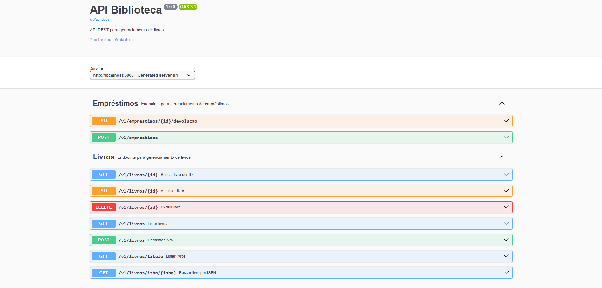
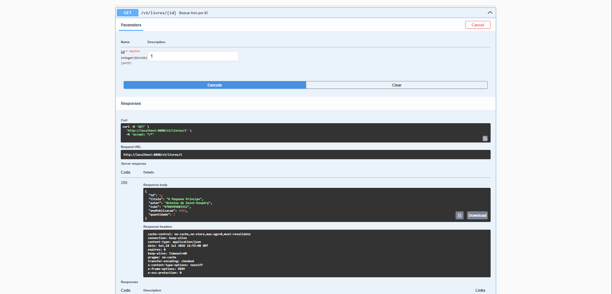

# API Biblioteca

API REST para gerenciamento de livros e empréstimos, desenvolvida com Java e Spring Boot.

## Swagger

### Visão geral



### Consulta de livro



## Funcionalidades

### Livros
- Cadastro de livros
- Listagem com paginação e ordenação
- Busca por ID
- Busca por título
- Busca por ISBN
- Atualização de livros
- Exclusão de livros
- Validação de ISBN duplicado

### Empréstimos
- Realização de empréstimos
- Devolução de livros
- Controle automático da quantidade disponível
- Controle de status do empréstimo

### Recursos
- Validação de dados com Bean Validation
- Tratamento global de exceções
- Autenticação com Spring Security
- Documentação da API com Swagger/OpenAPI
- Testes unitários com JUnit e Mockito

---

## Tecnologias

- Java 21
- Spring Boot
- Spring Web
- Spring Data JPA
- Spring Security
- Hibernate
- MySQL
- MapStruct
- Bean Validation
- Maven
- JUnit 5
- Mockito
- Docker
- Docker Compose
- Swagger/OpenAPI

---

## Arquitetura

O projeto segue a arquitetura em camadas:

```
Controller
    ↓
Service
    ↓
Repository
    ↓
Banco de Dados
```

---

## Como executar

### 1. Clone o repositório

```bash
git clone https://github.com/YuriiFreitass/api-biblioteca.git
```

### 2. Entre na pasta do projeto

```bash
cd api-biblioteca
```

### 3. Crie o arquivo `.env`

Copie o arquivo `.env.example` para `.env`:

```bash
cp .env.example .env
```

Caso utilize Windows, basta criar uma cópia do arquivo e renomeá-la para `.env`.

### 4. Inicie o banco de dados

```bash
docker compose up -d
```

### 5. Execute a aplicação

```bash
mvn spring-boot:run
```

A API ficará disponível em:

```
http://localhost:8080
```

---

## Documentação

Após iniciar a aplicação, acesse:

```
http://localhost:8080/swagger-ui/index.html
```

---

## Principais Endpoints

### Livros

```
GET    /v1/livros
GET    /v1/livros/{id}
GET    /v1/livros/buscar?titulo={titulo}
GET    /v1/livros/isbn/{isbn}
POST   /v1/livros
PUT    /v1/livros/{id}
DELETE /v1/livros/{id}
```

### Empréstimos

```
POST /v1/emprestimos
PUT  /v1/emprestimos/{id}/devolucao
```

---

## Segurança

A API utiliza autenticação HTTP Basic com Spring Security.

Existem permissões diferentes para usuários e administradores.

- **USER:** consulta de livros.
- **ADMIN:** cadastro, atualização, exclusão de livros e gerenciamento de empréstimos.

---

## Executando os testes

```bash
mvn test
```

---

## Autor

Desenvolvido por **Yuri Freitas**.
